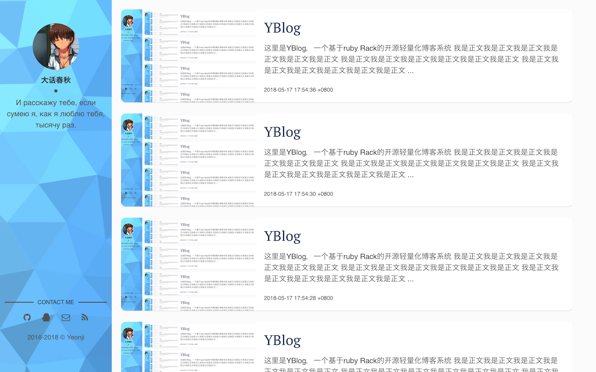

# YBlog

这里是YBlog，一个基于Rack的开源轻量化极易搭建的自助博客系统。

你可以在这里轻松使用Markdown来进行博客写作。[在线体验](https://www.short-circuits.org/YBlog/try/)

## 使用说明

### 快速部署

1. 请确认ruby版本号 >= 2.1.0
2. 使用gem安装nokogiri和rack `gem install rack` `gem install nokogiri`
3. 下载项目源代码到本地
4. 在项目目录下运行`rackup`
5. 开始写blog吧

### Login & Writing

什么你没找到登录入口？

猛戳头像下你自己名字试试？（是不是很恶趣味

### 便捷升级

1. 下载新版本源代码
2. 将原始版本的data目录复制到新版本目录下（替换）
3. `rackup`

### 轻松定制
1. 编辑`settings.rb`修改各种文本信息
2. 编就`config.ru`修改端口和监听地址
3. 替换`data/image`里面的默认背景和头像
4. 修改`data/users/admin.json`内的用户名和密码（文件名要和用户名一致哦）
5. 如果你想要，可以到`script/templet`目录下修改模版来进行深度定制

好了这已经是你自己的blog了

## Components / Libraries

样式表: [normalize.css](https://github.com/necolas/normalize.css)

编辑器: [editor.md](https://github.com/pandao/editor.md)

（我知道编辑页面很丑，我也不知道怎么写好看啊，反正能用就行了吧）

默认头像: [(ˉ﹃ˉ)EM1234 @ pixiv.net](https://www.pixiv.net/member.php?id=8467971)

默认背景: [lowpoly](https://github.com/cojdev/lowpoly)

## License

The Apache License. see LICENSE file
